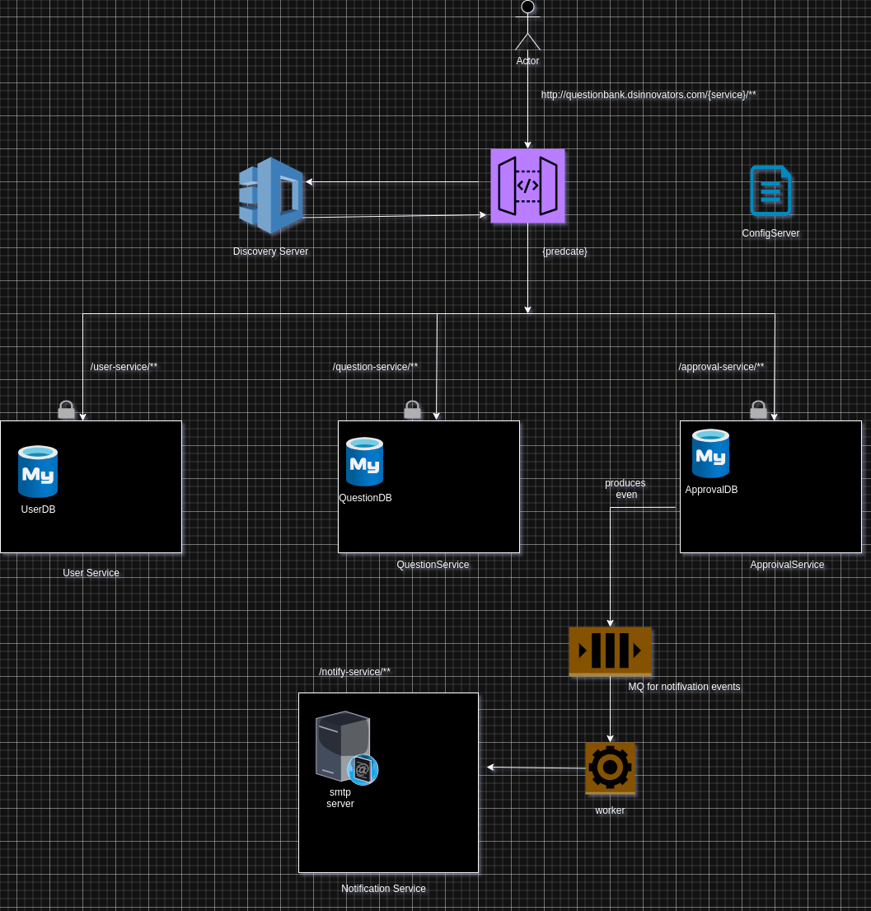
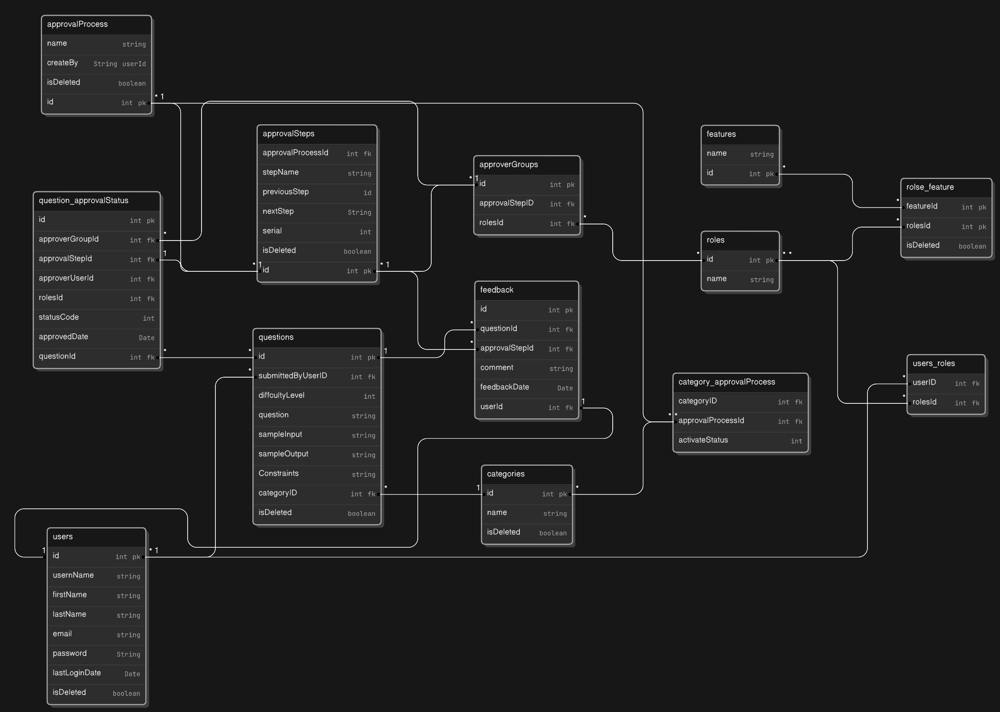
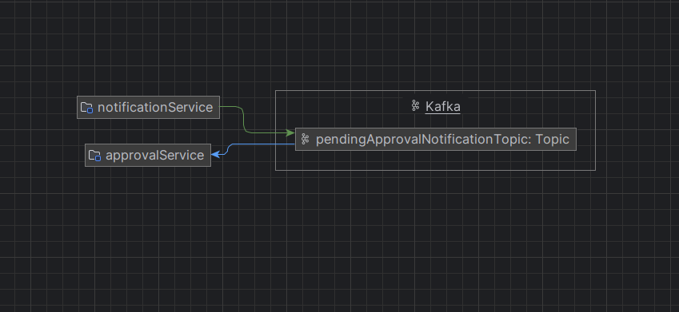

# Question Bank with Approval Process

## Application Structure

## Database

## API SERVICES
### 1. User Service
This service handles the user related information.
It handles 3 different entity types:
1. User
2. Roles
3. Features

#### User
user is the main actor of the system. This handles the login related information and jwt token creation.
#### Roles
Roles are the different roles that a user can have in the system.
A role is defined by a name and a set of features. A user can have multiple roles.

#### Features
FEATURES are the different features that a user can have in the system.
A feature is defined by a name and a set of permissions. A feature is different type of user scenarios of this system

### 2. Question Service
This service handles the question related information. Such as Question creation, edit. This service has the following entities
1. Question
2. Category

#### Question
Question is the main entity of this service. A question can be in the following status:
1. Pending
2. Approved
3. Rejected

A question is linked to a category. A question is linked to a single category only.

#### Category
Category is the entity that is used to categorize the questions. A category can have multiple questions.
based on the category the approval steps will be defined. 

### 3. Approval Service
This handles all the business logic related to the approval process. This service has the following entities:
1. Approval Process
2. Approval Step
3. Category Approval Process
4. Aprpover Group
5. Feedback
6. Approvals

#### Approval Process
Approval process is the process that is linked with the category and defines the steps that are required to approve a question. An approval process is what linkes a category with the approval steps.
and eventually this is what will define the approval steps for a question.

#### Approval Step
Approval step is the step that is required to approve a question. An approval step is linked to an approval process 
and defines the approver group that is required to approve the question.

#### Category Approval Process
Category Approval Process is the entity that links the category with the approval process. 
This is what defines the approval process for a category. A category can have multiple approval processes.
but at any given time it will have only one **ACTIVE** approval process. when a new approval process is created for a category
it wil be in **DRAFT** status.
Once the approval process is ready to be used it can be activated and it will be in **ACTIVE** status.

#### Approver Group
Approver Group is the entity that defines the group of approvers that are required to approve a question.
A Step can have multiple approver group, This approver group is bascially
the list of **Roles** that have permission to approve any question at a step of approval process.

#### Feedback
A user can give a feedback at any step of the approval process. 
This feedback is linked to thq Question, the approval step and the user who gave the feedback.

#### Approvals
An approval is the entity that is created when a question is approved by a user at any step of the approval process.
when an approval is given the question is moved to the next step of the approval process and at that time
a notification even is generated and notification is sent to the next approver group.
and the users with the roles in the approver will get the notification. 

## MQ for sending notification

## Discovery Server
This is the Eureka server that is used to register all the services.
This is the service registry that is used to register all the services.

## Gateway Server
This is the gateway server that is used to route all the requests to the respective services.
this handles the auth check and routes the request to the respective service.

## Future Scope
1. Removing the authentication logic from user service and move to a AuthService
2. Adding Auditing using JPA Auditing
3. Adding Retry using Resilience4j
4. Adding Circuit Breaker using Resilience4j
5. Adding distributed tracing using Zipkin
6. 